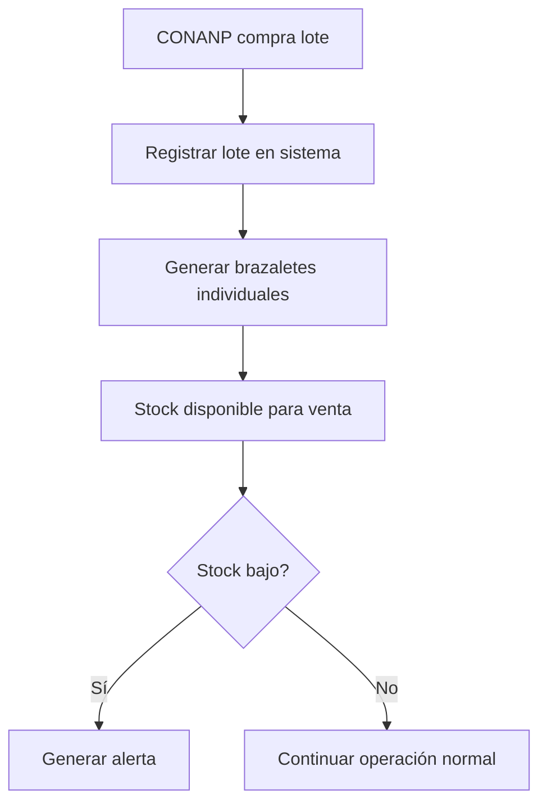
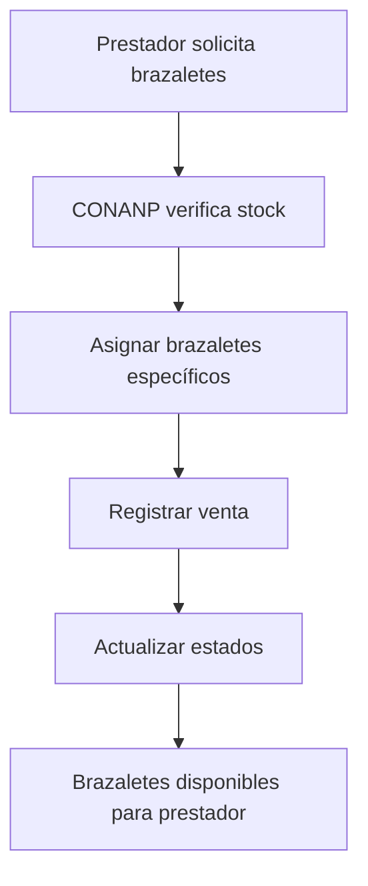
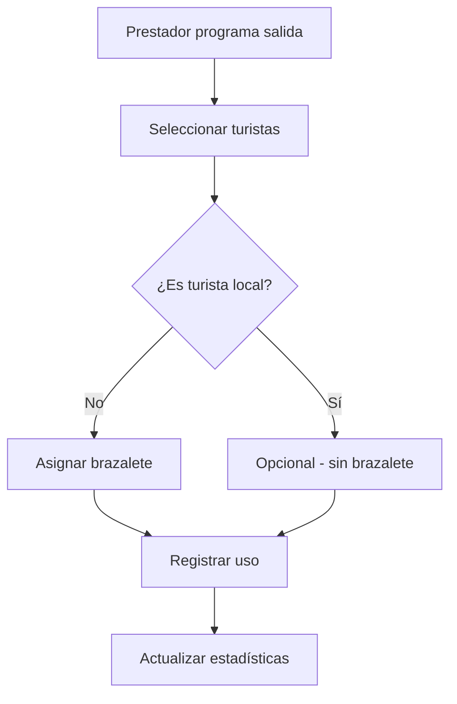

# Propuesta: Sistema de Gestión de Brazaletes para Isla Lobos

## 📋 Resumen Ejecutivo

Se propone reemplazar el sistema actual de gestión de ingresos por un sistema de gestión de brazaletes que CONANP vende a los prestadores para el control de turistas en áreas protegidas. Este cambio permitirá un mejor control del aforo, regulación turística efectiva y datos más relevantes para la toma de decisiones.

## 🎯 Objetivos del Sistema

- **Control de aforo**: Monitoreo preciso del número de visitantes en áreas protegidas
- **Gestión de inventario**: Control de stock de brazaletes y alertas de reabastecimiento
- **Regulación turística**: Cumplimiento de normativas ambientales y de conservación
- **Datos de visitantes**: Tracking por nacionalidad (locales vs. no-locales)
- **Ingresos directos**: Venta de brazaletes a prestadores

## 🏗️ Arquitectura de Base de Datos

### Tabla: `brazaletes`

```sql
CREATE TABLE brazaletes (
  id UUID PRIMARY KEY DEFAULT gen_random_uuid(),
  codigo VARCHAR(50) UNIQUE NOT NULL,              -- Código único del brazalete
  tipo VARCHAR(20) NOT NULL CHECK (tipo IN ('isla', 'arrecife')),
  estado VARCHAR(20) NOT NULL DEFAULT 'disponible' CHECK (estado IN ('disponible', 'asignado', 'utilizado', 'perdido')),
  precio DECIMAL(10,2) NOT NULL,                   -- Precio de venta a prestadores
  fecha_creacion TIMESTAMP NOT NULL DEFAULT NOW(),
  fecha_asignacion TIMESTAMP NULL,                 -- Cuando se vendió al prestador
  fecha_uso TIMESTAMP NULL,                        -- Cuando se usó en una salida
  prestador_id UUID NULL REFERENCES usuarios(id),  -- Prestador que compró el brazalete
  salida_id UUID NULL REFERENCES salidas(id),      -- Salida donde se usó
  turista_nacionalidad VARCHAR(50) NULL,           -- 'local', 'nacional', 'internacional'
  turista_edad INTEGER NULL,
  lote_id UUID NOT NULL REFERENCES lotes_brazaletes(id),
  created_at TIMESTAMP NOT NULL DEFAULT NOW(),
  updated_at TIMESTAMP NOT NULL DEFAULT NOW()
);

-- Índices para optimización
CREATE INDEX idx_brazaletes_estado ON brazaletes(estado);
CREATE INDEX idx_brazaletes_prestador ON brazaletes(prestador_id);
CREATE INDEX idx_brazaletes_salida ON brazaletes(salida_id);
CREATE INDEX idx_brazaletes_tipo ON brazaletes(tipo);
CREATE INDEX idx_brazaletes_fecha_uso ON brazaletes(fecha_uso);
```

### Tabla: `lotes_brazaletes`

```sql
CREATE TABLE lotes_brazaletes (
  id UUID PRIMARY KEY DEFAULT gen_random_uuid(),
  numero_lote VARCHAR(50) UNIQUE NOT NULL,         -- Identificador del lote
  cantidad_total INTEGER NOT NULL,                 -- Brazaletes en el lote
  cantidad_disponibles INTEGER NOT NULL,           -- Brazaletes disponibles
  cantidad_vendidos INTEGER NOT NULL DEFAULT 0,    -- Brazaletes vendidos
  cantidad_utilizados INTEGER NOT NULL DEFAULT 0,  -- Brazaletes utilizados
  tipo VARCHAR(20) NOT NULL CHECK (tipo IN ('isla', 'arrecife')),
  fecha_compra TIMESTAMP NOT NULL,                 -- Fecha de compra del lote
  fecha_vencimiento TIMESTAMP NULL,                -- Fecha de vencimiento (opcional)
  costo_unitario DECIMAL(10,2) NOT NULL,           -- Costo para CONANP
  precio_venta DECIMAL(10,2) NOT NULL,             -- Precio de venta a prestadores
  proveedor VARCHAR(100) NULL,                     -- Proveedor del lote
  estado VARCHAR(20) NOT NULL DEFAULT 'activo' CHECK (estado IN ('activo', 'agotado', 'vencido', 'cancelado')),
  observaciones TEXT NULL,
  created_at TIMESTAMP NOT NULL DEFAULT NOW(),
  updated_at TIMESTAMP NOT NULL DEFAULT NOW()
);

-- Índices para optimización
CREATE INDEX idx_lotes_tipo ON lotes_brazaletes(tipo);
CREATE INDEX idx_lotes_estado ON lotes_brazaletes(estado);
CREATE INDEX idx_lotes_fecha_compra ON lotes_brazaletes(fecha_compra);
```

### Tabla: `ventas_brazaletes` (Opcional - para tracking detallado)

```sql
CREATE TABLE ventas_brazaletes (
  id UUID PRIMARY KEY DEFAULT gen_random_uuid(),
  prestador_id UUID NOT NULL REFERENCES usuarios(id),
  lote_id UUID NOT NULL REFERENCES lotes_brazaletes(id),
  cantidad INTEGER NOT NULL,
  precio_unitario DECIMAL(10,2) NOT NULL,
  total DECIMAL(10,2) NOT NULL,
  fecha_venta TIMESTAMP NOT NULL DEFAULT NOW(),
  metodo_pago VARCHAR(50) NULL,                    -- 'efectivo', 'transferencia', 'credito'
  estado_pago VARCHAR(20) DEFAULT 'pendiente' CHECK (estado_pago IN ('pendiente', 'pagado', 'cancelado')),
  observaciones TEXT NULL,
  created_at TIMESTAMP NOT NULL DEFAULT NOW()
);

-- Índices
CREATE INDEX idx_ventas_prestador ON ventas_brazaletes(prestador_id);
CREATE INDEX idx_ventas_fecha ON ventas_brazaletes(fecha_venta);
```

## 🔄 Flujo de Trabajo

### 1. **Gestión de Inventario (CONANP)**



### 2. **Venta a Prestadores**



### 3. **Uso en Salidas**



## 📡 API Endpoints

### **Gestión de Inventario**

#### `GET /api/brazaletes/inventario`

**Descripción**: Obtener estado actual del inventario

```json
{
  "success": true,
  "data": {
    "total_disponibles": 1500,
    "por_tipo": {
      "isla": 800,
      "arrecife": 700
    },
    "stock_bajo": false,
    "lotes_activos": 3,
    "valor_inventario": 45000.0
  }
}
```

#### `POST /api/brazaletes/lotes`

**Descripción**: Crear nuevo lote de brazaletes

```json
// Request
{
  "numero_lote": "LOT-2024-001",
  "cantidad_total": 1000,
  "tipo": "isla",
  "costo_unitario": 5.00,
  "precio_venta": 15.00,
  "proveedor": "Brazaletes del Caribe S.A.",
  "fecha_vencimiento": "2025-12-31"
}

// Response
{
  "success": true,
  "data": {
    "lote": { /* lote creado */ },
    "brazaletes_generados": 1000,
    "message": "Lote creado exitosamente"
  }
}
```

#### `GET /api/brazaletes/lotes`

**Descripción**: Listar lotes con filtros

```json
// Query params: ?tipo=isla&estado=activo&page=1&limit=10
{
  "success": true,
  "data": {
    "lotes": [
      /* array de lotes */
    ],
    "pagination": {
      "page": 1,
      "limit": 10,
      "total": 25,
      "total_pages": 3
    }
  }
}
```

### **Venta a Prestadores**

#### `POST /api/brazaletes/venta`

**Descripción**: Vender brazaletes a un prestador

```json
// Request
{
  "prestador_id": "uuid-del-prestador",
  "cantidad": 50,
  "tipo": "isla",
  "metodo_pago": "efectivo"
}

// Response
{
  "success": true,
  "data": {
    "venta_id": "uuid-de-venta",
    "brazaletes_asignados": [/* array de códigos */],
    "total": 750.00,
    "message": "Venta realizada exitosamente"
  }
}
```

#### `GET /api/brazaletes/prestador/:id`

**Descripción**: Obtener brazaletes de un prestador específico

```json
{
  "success": true,
  "data": {
    "prestador": {
      /* info del prestador */
    },
    "brazaletes": {
      "disponibles": 45,
      "asignados": 50,
      "utilizados": 120,
      "por_tipo": {
        "isla": 80,
        "arrecife": 35
      }
    },
    "detalle": [
      /* array de brazaletes */
    ]
  }
}
```

### **Uso en Salidas**

#### `POST /api/brazaletes/uso`

**Descripción**: Registrar uso de brazalete en una salida

```json
// Request
{
  "salida_id": "uuid-de-salida",
  "brazaletes": [
    {
      "codigo": "BRZ-2024-001",
      "turista_nacionalidad": "internacional",
      "turista_edad": 35
    }
  ]
}

// Response
{
  "success": true,
  "data": {
    "brazaletes_utilizados": 1,
    "message": "Uso registrado exitosamente"
  }
}
```

#### `GET /api/brazaletes/uso/salida/:id`

**Descripción**: Obtener brazaletes utilizados en una salida

```json
{
  "success": true,
  "data": {
    "salida": {
      /* info de la salida */
    },
    "brazaletes_utilizados": [
      /* array de brazaletes */
    ],
    "estadisticas": {
      "total_brazaletes": 15,
      "por_nacionalidad": {
        "locales": 5,
        "nacionales": 3,
        "internacionales": 7
      }
    }
  }
}
```

### **Reportes y Estadísticas**

#### `GET /api/brazaletes/estadisticas`

**Descripción**: Obtener estadísticas generales

```json
{
  "success": true,
  "data": {
    "periodo": {
      "fecha_inicio": "2024-01-01",
      "fecha_fin": "2024-01-31"
    },
    "inventario": {
      "total_comprados": 5000,
      "total_disponibles": 1500,
      "total_vendidos": 2500,
      "total_utilizados": 1000
    },
    "ingresos": {
      "ventas_totales": 37500.0,
      "por_mes": [
        { "mes": "enero", "monto": 15000.0 },
        { "mes": "febrero", "monto": 22500.0 }
      ]
    },
    "utilizacion": {
      "por_tipo": {
        "isla": 600,
        "arrecife": 400
      },
      "por_nacionalidad": {
        "locales": 200,
        "nacionales": 300,
        "internacionales": 500
      }
    }
  }
}
```

#### `GET /api/brazaletes/alertas`

**Descripción**: Obtener alertas del sistema

```json
{
  "success": true,
  "data": {
    "alertas": [
      {
        "tipo": "stock_bajo",
        "severidad": "alta",
        "mensaje": "Solo quedan 50 brazaletes de tipo 'isla'",
        "fecha": "2024-01-15T10:30:00Z"
      },
      {
        "tipo": "lote_por_vencer",
        "severidad": "media",
        "mensaje": "Lote LOT-2023-005 vence en 30 días",
        "fecha": "2024-01-15T10:30:00Z"
      }
    ]
  }
}
```

## 🔧 Funcionalidades Técnicas

### **Generación de Códigos**

- **Formato**: `BRZ-{AÑO}-{NÚMERO_SECUENCIAL}`
- **Ejemplo**: `BRZ-2024-000001`
- **Unicidad**: Garantizada por constraint UNIQUE

### **Alertas Automáticas**

- **Stock bajo**: Cuando queden menos del 10% del inventario
- **Lotes por vencer**: 30 días antes del vencimiento
- **Prestadores sin stock**: Prestadores con menos de 10 brazaletes

### **Validaciones**

- **Venta**: Verificar que el prestador esté activo
- **Uso**: Verificar que el brazalete esté asignado al prestador
- **Estados**: Validar transiciones de estado válidas

### **Auditoría**

- **Logs de cambios**: Registrar todas las modificaciones
- **Trazabilidad**: Seguimiento completo del ciclo de vida del brazalete
- **Backup**: Respaldo automático de datos críticos

## 📊 Dashboard CONANP - Nuevas Métricas

### **Widgets Principales**

1. **Inventario Actual**

   - Total disponible por tipo
   - Stock bajo (alerta)
   - Valor del inventario

2. **Ventas del Día**

   - Brazaletes vendidos
   - Ingresos por ventas
   - Prestadores activos

3. **Utilización**

   - Brazaletes usados hoy
   - Por nacionalidad
   - Lugares más populares

4. **Alertas**
   - Stock crítico
   - Lotes por vencer
   - Prestadores sin stock

### **Reportes Disponibles**

- **Inventario**: Estado actual y histórico
- **Ventas**: Por prestador, fecha, tipo
- **Utilización**: Por área, temporada, nacionalidad
- **Financiero**: Ingresos, costos, rentabilidad

## 🚀 Plan de Implementación

### **Fase 1: Base de Datos (1-2 semanas)**

- [ ] Crear tablas de brazaletes y lotes
- [ ] Implementar índices y constraints
- [ ] Migrar datos existentes (si aplica)

### **Fase 2: API Core (2-3 semanas)**

- [ ] Endpoints de gestión de inventario
- [ ] Endpoints de venta a prestadores
- [ ] Endpoints de uso en salidas
- [ ] Validaciones y middleware

### **Fase 3: Reportes y Alertas (1-2 semanas)**

- [ ] Sistema de estadísticas
- [ ] Alertas automáticas
- [ ] Reportes exportables

### **Fase 4: Integración Frontend (1-2 semanas)**

- [ ] Actualizar dashboard CONANP
- [ ] Nuevas interfaces de gestión
- [ ] Testing y validación

## 💰 Consideraciones Financieras

### **Modelo de Costos**

- **Costo unitario**: $5.00 MXN por brazalete
- **Precio de venta**: $15.00 MXN por brazalete
- **Margen**: $10.00 MXN por brazalete (200% markup)

### **Proyección Mensual**

- **Venta estimada**: 2,000 brazaletes/mes
- **Ingresos**: $30,000 MXN/mes
- **Costos**: $10,000 MXN/mes
- **Utilidad**: $20,000 MXN/mes

## ⚠️ Consideraciones y Riesgos

### **Técnicos**

- **Migración de datos**: Planificar migración desde sistema actual
- **Performance**: Índices optimizados para consultas frecuentes
- **Backup**: Estrategia de respaldo para datos críticos

### **Operacionales**

- **Capacitación**: Entrenamiento para personal de CONANP
- **Proveedores**: Establecer relaciones con proveedores confiables
- **Inventario**: Sistema de control físico paralelo

### **Regulatorios**

- **Normativas**: Cumplimiento con regulaciones ambientales
- **Auditorías**: Sistema preparado para auditorías
- **Trazabilidad**: Registro completo del flujo de brazaletes

## 📞 Contacto y Soporte

Para implementación y soporte técnico:

- **Desarrollador Principal**: [Nombre]
- **Email**: [email@conanp.gob.mx]
- **Teléfono**: [Número]

---

**Documento preparado para**: CONANP - Isla Lobos  
**Fecha**: Enero 2024  
**Versión**: 1.0  
**Estado**: Propuesta para revisión
